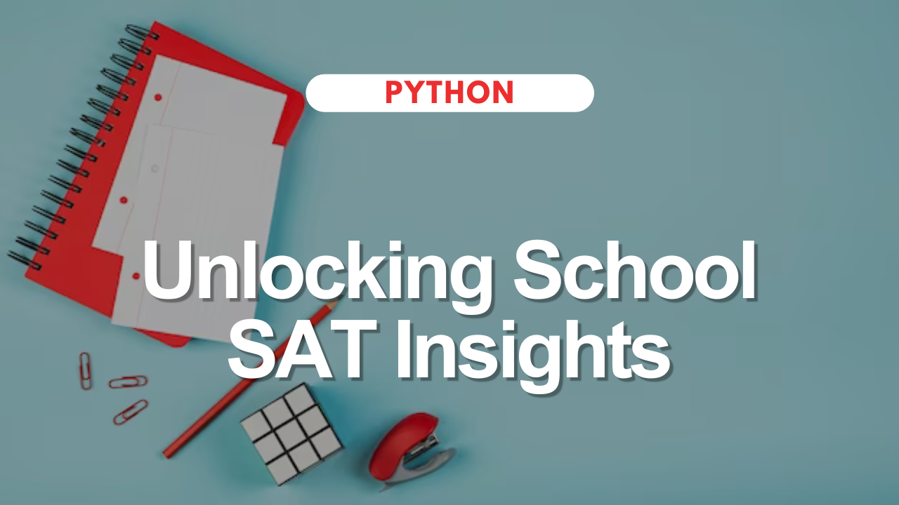

## Python Project Summary: NYC Public School SAT Performance Analysis

### Overview:
American high school students take SAT exams annually to assess literacy, numeracy, and writing skills. Analyzing NYC public school SAT performance aids policymakers, educators, researchers, government officials, and parents in decision-making. [Click here to view the project.](https://github.com/jessicabohannon/NYC-Public-School-SAT-Scores/blob/main/notebook.ipynb)

### Python Skills Demonstrated:
- **Data Manipulation**: Utilized Pandas for loading, preprocessing, filtering, sorting, and summarizing data.
- **Exploratory Data Analysis (EDA)**: Conducted EDA to answer key questions regarding NYC public school SAT performance.
- **DataFrame Operations**: Employed various DataFrame operations for data analysis.
- **Statistical Analysis**: Utilized statistical methods to derive insights from the dataset.

### Key Questions Explored:
1. Identification of Top Performing NYC Schools in Math
2. Top 10 Performing Schools Based on Combined SAT Scores
3. Analysis of Borough with Largest Standard Deviation in SAT Scores

### Implementation:
- Loaded dataset using Pandas, filtered and sorted schools based on math performance.
- Calculated combined SAT scores and identified top 10 performing schools.
- Analyzed standard deviation in SAT scores across NYC boroughs.

### Conclusion (Skills Highlight):
Through Python programming and data analysis techniques, demonstrated proficiency in data manipulation, EDA, DataFrame operations, and statistical analysis.
